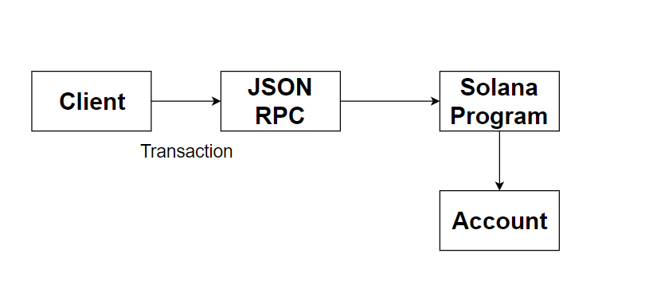

## Solana Programming Model
Solana is a Layer-1 solution to the awful scalability problem that several blockchains are experiencing. The major purpose of Solana Programming is to take clients’ input and change on-chain information as needed. Solana program is written on C/C++/Rust programming language. But it doesn’t mean that your application must be written on C/C++/Rust, you can use any language to write your front-facing application, so it is language-independent. Solana node accepts HTTP requests using JSON-RPC specification and returns the response to the client. JSON-RPC is a format that uses as a data storage format. It also works as a middle layer between the client and the Solana Node.

A client app can send a request with JSON-RPC to the Solana Node known as transactions. Each transaction can have one to many instructions. For each transaction, instructions are performed sequentially and atomically. Solana's account model is far more complex than Ethereum's because of it's storage and data accessing mechanism. If any instruction is invalid, the transaction's account modifications are discarded.

An instruction contains three key parts: 
1) The program id which is a public key of the program and it should be executed.
2) A subset of the transaction's accounts to be sent to the program which will be affected.
3) A data byte array – used to instruct the program on which functions to invoke and with what arguments.

Transactions can contain one or more digital signatures, each of which corresponds to an account address specified in the transaction. The program might return with a success code or an error code. When there is an error return, the entire transaction fails instantly.

Solana's system architecture is divided into clusters and validators. A cluster is a group of validators that make up a Solana blockchain instance. The Solana community typically recognizes three clusters: Testnet, Devnet, and Mainnet Beta. For testing and development, Testnet and Devnet are utilized. The Mainnet Beta is the first-time tokens are acknowledged as having monetary worth. A transaction submitted to the incorrect cluster will be ignored.  Validators are the foundation of Solana's network. By engaging in consensus and completing transactions. Clients send transactions to a validator to network and Validator validate the transaction by using some consensus mechanism. Validation needs powerful computers or servers to approve all the transactions in the blockchain. 

Solana, one of the market's most groundbreaking blockchains, has employed the Proof of History concept to speed up transactions on their network and overcome the scalability problem that many cryptocurrencies face today.To validate the transaction Solana blockchain use proof-of-history mechanism. Proof of History (PoH) is a permissionless, network-wide source of time that functions before consensus. PoH is not a consensus process, but rather a cryptographic approach for tracking time in a blockchain network by establishing timestamps. PoH is secured because instead of depending on the transaction's timestamp, it may demonstrate that the transaction occurred before and after an event. PoH starts a cryptographic hash function at a random staring position to the end and take it as an input again and again. The system function counts the number of times the function is executed and then select any random string from the results of each previous call. 

Solana's PoH consensus mechanism contributes to increased efficiency and throughput rate inside the Solana network. By having historical records of events or transactions, it allows the system to more easily track transactions and keep track of the ordering of the events.

The runtime for the Solana network that allows for the concurrent execution of instructions and transactions. Despite differences in implementation and design, it is comparable to the Ethereum VM (EVM)

There are some special programs may be need to run on the network.\
•	System Program: The system program is in process of setting new accounts and assigning account ownership.\
•	BPF Loader: The BPF Loader program is in responsible of Solana software deployment, updates, and instruction execution\
•	Token Programs: Implements a fungible or non-fungible token other than native SOL token\

## Accounts

Solana accounts are used to store data quite similar to the concept of storing a file in a filesystem. In Filesystem files are indexed by filename where the accounts are indexed by a hash of the public key which is a 32-byte or 256-bit string.  Accounts also include metadata, which holds access control information and other account information. Lifetime of a file is also including in metadata represented by a set of fractional native tokens known as lamports. 

The lamports field keeps track of each account's balance. Any account with no lamports will be wiped out after a certain period.
Balance represents a certain amount of cryptocurrency or tokens held by an account. 

## Account Storage
A Solana ledger record that either carries data or is an executable program. A Solana account, like any other, may include money known as lamports. The way this data is kept and handled on the Solana differs from other blockchains such as Ethereum.

### Types of Account:
There are two types of account on the Solana blockchain: 
1)	Executable: It store an executable program and immutable. As executable accounts cannot be changed and can only contain executable byte code, their application state must be preserved in non-executable accounts.
2)	Non-executable: It hold the data associated with programs and keeps track of token balances and enables token transfers between them. Non-executable accounts are assigned an owner program address to govern who can edit this data. Other programs can view another account's data, but if they attempt to update it, the transaction fails.

Like Ethereum, Solana blockchain doesn’t store state/data and executable program in a single location. There is a distinction between the program and the program's data/state. Both are given different accounts but there is a link between them. If you wanted to construct a program then an account needed to execute the program and another account to keep track of the data storage. Executable accounts can access non-executable accounts.

### Rent
Storing all of this data in several accounts is not free and incurs costs. It's worth noting that accounts must pay rent in order to stay alive in a cluster. Accounts are kept in validator memory and must pay "rent" to stay on the memory. When validators scan an account, they collect rent, if the account balance is zero, it is wiped. Each validator scans all accounts and collects rent on a regular basis. Accounts with a sufficient number of lamports can also be recognized as rent-exempt. The higher the rent, the greater the quantity of data held. 
An epoch lasts around ~3 days. Withing this time If an account has a zero balance and is not able to pay the rent, it gets wiped from the blockchain. There has been no change to the rent epoch connected with this account.
If an account has at least two years' worth of rent, it is called rent-free which is checked by a validator every time when the balance is reduced. The runtime requires program executable accounts to be rent-free in order to prevent being deleted.

### How to create an account
A client produces a keypair and registers its public key to create an account by using the SystemProgram::CreateAccount instruction. The maximum data size for an account is currently 10 megabytes. If extra space is needed, a program can replicate the data from one account to another with greater space. An address is 256-bit value. First 128-bit store the private key and next 128-bit used to store public key. 

An owner must be assigned to an account when an account created. Only the account's owner has the ability to the modify the data in the account. If the program doesn’t associate with any accounts, then the application is provided an account with no data and zero lamports held by the system program. 

Newly formed accounts reflect whether they sign the transaction and can therefore be utilized as an authority. The transfer instructions would be signed by the user with their private key, and the System Program would handle the deduction of tokens from the sender and crediting the receiver account. Private key is used to sign any transaction and anyone can verify the ownership of the transaction using the public key and message signature. So, we can easily verify the ownership using message signature and public key associate with it.

At the time of initialization, Program is owned by the built-in program called System program and also called a system account aptly. An account has "owner" metadata. A program id serves as the owner. If the program's id matches the owner's, the runtime provides it write access to the account. 

The System program's runtime allows clients to transfer lamports and, more crucially, assign account ownership, which means changing the owner to a new program id. The program can only read its data and credit the account if a program does not own an account. The amount of an account that has not been assigned to the program cannot be reduced.

As program code and data are kept in different accounts, any program can read data from another account. Any application can add lamports to an account, but only the account owner can remove them. This is important when developing applications that may need to connect with accounts that they do not possess.

## Conclusion:
Solana addresses many of the usual concerns that previous blockchain technologies encountered.  Solana demonstrates a novel structure for transaction verification as well as a more efficient consensus mechanism. The platform will undoubtedly compete with Bitcoin and Ethereum.
